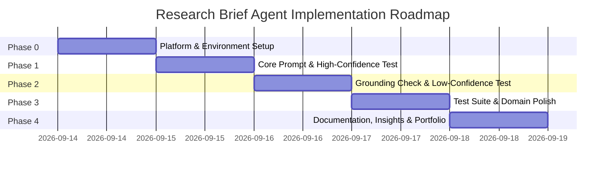

# Implementation Roadmap & Phases — Research Brief Agent

**Project:** Research Brief Agent  
**Context:** RemoteInternGlobal Internship Assessment Project  
**Status:** Active  
**Current Phase:** Phase 0 — Setup & Platform Exploration  

---

## Roadmap Overview

---

## Phase 0 — Setup & Platform Exploration

### Objective
Establish the execution environment, confirm LLM platform capabilities, determine retrieval tool access (native search vs. context ingestion), and initialize the repository structure.

### Features
- Environment initialization and verification.
- Confirmation of model access (Gemini / GPT / Claude) and search tool availability.
- Scaffold folder structure (`prompts/`, `test_cases/`, `outputs/`, `artifacts/`).

### Files / Components Created or Modified
- `prompts/system_prompt.md` [NEW]
- `test_cases/high_confidence_topics.json` [NEW]
- `test_cases/low_confidence_edge_cases.json` [NEW]
- `Memory.md` [MODIFY]

### Dependencies
- Access to an instruction-tuned LLM workspace or API key.
- Confirmation of platform constraints from the internship portal.

### Implementation Tasks
- [ ] Confirm platform environment (Google AI Studio, OpenAI Playground, Coze, or local Python script).
- [ ] Verify whether the platform exposes live web search or requires pasted context blocks.
- [ ] Create folder structure (`prompts/`, `test_cases/`, `outputs/`, `artifacts/screenshots/`).
- [ ] Document platform details and model parameters in `Memory.md`.

### Testing
- Send a minimal "ping" test to the model to verify response time and tool binding.

### Acceptance Criteria
- Model responds reliably; retrieval mechanism is verified; project structure is initialized on disk.

### Documentation Updates
- Update `Memory.md` with active platform, chosen model, and retrieval method.

---

## Phase 1 — Core Prompt & Baseline Output Verification

### Objective
Engineer the primary system prompt, configure schema enforcement, and validate that the agent consistently produces the 4-part brief format on a standard, high-confidence topic.

### Features
- Rigorous system prompt with strict output formatting.
- Execution on 1 standard topic (e.g., *"Current state of enterprise RAG systems"* or *"AI coding agents in 2025"*).
- Structural verification of the 4 sections: Summary, Key Points (3–5 bullets), Sources, Confidence Note.

### Files / Components Created or Modified
- `prompts/system_prompt.md` [MODIFY]
- `outputs/phase1_baseline_brief.md` [NEW]
- `Memory.md` [MODIFY]

### Dependencies
- Phase 0 completed.

### Implementation Tasks
- [ ] Draft and save the production prompt in `prompts/system_prompt.md`.
- [ ] Execute prompt against 1 high-confidence benchmark query with retrieval context.
- [ ] Save the generated output to `outputs/phase1_baseline_brief.md`.
- [ ] Verify that the brief strictly contains:
  - Summary (2–3 sentences)
  - Key Points (3–5 bullets, all grounded)
  - Sources (clean list)
  - Confidence Note (evaluating evidence strength as High)

### Testing
- Format check: Validate headers and bullet counts.
- Grounding check: Confirm each bullet point maps to an actual retrieved snippet.

### Acceptance Criteria
- 100% adherence to the 4-part markdown structure; zero ungrounded claims; output saved to `outputs/phase1_baseline_brief.md`.

### Documentation Updates
- Record Phase 1 test results in `Memory.md` and link `outputs/phase1_baseline_brief.md`.

---

## Phase 2 — Grounding & Low-Confidence Edge Case Verification

### Objective
Execute the critical test that differentiates this agent from generic chatbots: deliberately test a query with thin, contradictory, or zero source material, verifying that the agent enters the explicit low-confidence degradation path rather than hallucinating.

### Features
- Low-confidence trigger evaluation (VaultMind-RAG architectural safeguard).
- Anti-hallucination verification using an unindexed, obscure, or non-existent entity.
- Capture of the primary **"Output Verification" screenshot** for the internship assessment submission.

### Files / Components Created or Modified
- `prompts/system_prompt.md` [REFINE if needed]
- `outputs/phase2_low_confidence_brief.md` [NEW]
- `artifacts/screenshots/` [NEW]
- `Memory.md` [MODIFY]

### Dependencies
- Phase 1 completed.

### Implementation Tasks
- [ ] Select or design a thin-evidence test query (e.g., a fabricated startup name or obscure micro-topic).
- [ ] Run the query through the agent with live search / empty context.
- [ ] Verify that the agent:
  - Does NOT invent founders, funding, or facts.
  - States in the Summary that no credible evidence was found.
  - Sets the Confidence Note to *"Low confidence: insufficient verifiable sources found..."*
- [ ] Save output to `outputs/phase2_low_confidence_brief.md`.
- [ ] Capture the config/prompt setup and the low-confidence output for assessment review.

### Testing
- Hallucination audit: Check if any ungrounded fact was fabricated. If even one fabricated detail appears, adjust system prompt negative constraints and re-test.

### Acceptance Criteria
- Zero hallucinations produced; explicit low-confidence statement issued; screenshot captured and cataloged in `artifacts/screenshots/`.

### Documentation Updates
- Update `Memory.md` with test findings, prompt adjustments, and screenshot metadata.

---

## Phase 3 — Test Suite Execution & Multi-Domain Polish

### Objective
Run the agent across multiple diverse knowledge domains (Marketing, Technology, Business Development, Competitive Analysis) to ensure consistent tone, brevity, and citation fidelity across varied query complexities.

### Features
- Multi-domain test suite execution.
- Source attribution formatting refinement (ensuring clean hyperlinks or clean canonical titles).
- Edge-case handling for ambiguous or broad topics.

### Files / Components Created or Modified
- `test_cases/high_confidence_topics.json` [EXPAND]
- `outputs/multi_domain_briefs.md` [NEW]
- `Memory.md` [MODIFY]

### Dependencies
- Phase 2 completed.

### Implementation Tasks
- [ ] Run Test Case A: Content/Marketing topic (e.g., *"B2B SaaS product-led growth benchmarks"*).
- [ ] Run Test Case B: BD / Company Due Diligence (e.g., *"Recent strategic partnerships of Databricks"*).
- [ ] Run Test Case C: Technical architecture overview (e.g., *"MCP (Model Context Protocol) architecture and adoption"*).
- [ ] Verify that all outputs maintain identical structure, professional tone, and scannable formatting.
- [ ] Aggregate sample briefs into `outputs/multi_domain_briefs.md`.

### Testing
- Cross-domain consistency inspection.

### Acceptance Criteria
- All 3 test cases generate consistent 4-part briefs with verified sources and appropriate confidence ratings.

### Documentation Updates
- Update `Memory.md` with multi-domain verification status.

---

## Phase 4 — Documentation, Portfolio Artifacts & Key Insights

### Objective
Consolidate all project artifacts, write the assessment submission summary, document "Key Insights" (focusing on the low-confidence path learned from VaultMind-RAG), and prepare the final deliverable pack.

### Features
- Final assessment write-up document.
- Cataloged screenshots for the internship submission portal.
- Key Insights & Engineering Retrospective.

### Files / Components Created or Modified
- `artifacts/executive_summary.md` [NEW]
- `README.md` [NEW]
- `Memory.md` [FINALIZE]

### Dependencies
- Phases 0–3 completed.

### Implementation Tasks
- [ ] Write `artifacts/executive_summary.md` detailing the agent's problem statement, architecture, grounding safeguard, and test results.
- [ ] Write up the "Key Insights" section highlighting why the low-confidence path is the key interview-ready talking point.
- [ ] Assemble screenshots into `artifacts/screenshots/`.
- [ ] Create a root `README.md` guiding evaluators through the documentation and test results.
- [ ] Perform final audit against `Universal Project Documentation Prompt.md` consistency criteria.

### Testing
- Verify all links, images, and file references across all 6 core documents.

### Acceptance Criteria
- Submission pack complete; 100% doc consistency; clear demonstration of anti-hallucination capabilities.

### Documentation Updates
- Mark all phases complete in `Phases.md` and transition `Memory.md` to Final State.
